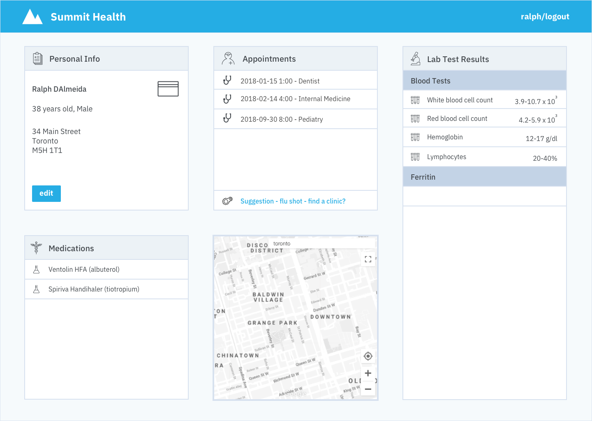
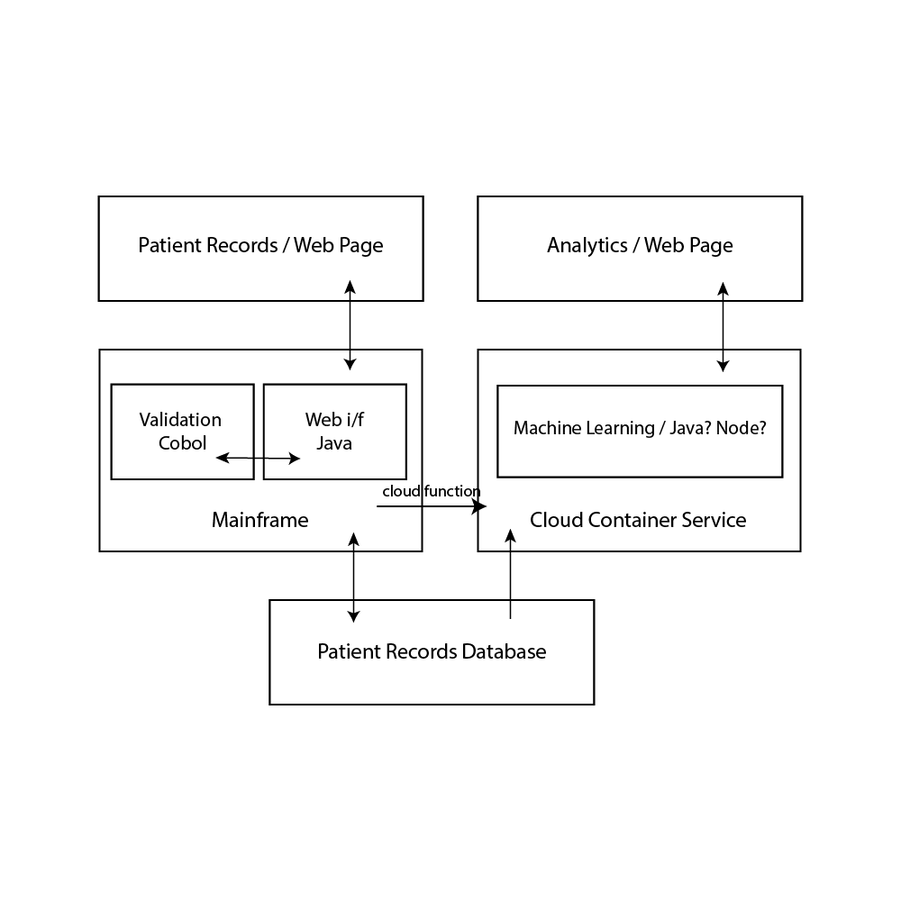

# health-records-system

This project is a conceptual health records system, designed to showcase best in class integration of cloud technology, in collaboration with mainframe code.

In particular, this project aims to produce, and describe examples for the following case studies:

- create a Java integration with a COBOL z/OS backend code pattern
- use some data analytics - Watson or ML code pattern
- create a serverless with a COBOL z/OS backend code pattern
- create a private cloud/zOS integration code pattern
- integrate blockchain based records with z/OS [ code pattern - Ash ]
- establish a modular demonstrable app that can be always ready to share these examples with developers, clients, analysts [ client/analyst demo]

Run a patient simulation to populate and trigger the system

#### Summit Health Context

Summit Health is a conceptual healthcare/insurance type company. It has been around a long time, and has 100s of thousands of patient records in an SQL database connected to a mainframe.

The validation system for the records is written in COBOL. It has some entitlement rules, prescription rules, coverage rules coded in there.

On the same mainframe there is Java code that connects with the validation system to serve web pages to individual clients of Summit.

Summit's health records look very similar to the health records of most insurance companies.

Here's a view a client might see when they log in:

Summit has recently started understanding how machine learning on some of the patient records, might surface interesting insights. There is lots of talk about this among some of the big data companies.

https://ai.googleblog.com/2018/05/deep-learning-for-electronic-health.html

https://blog.adafruit.com/2018/04/16/machine-learning-helps-to-grok-blood-test-results/

[ concept screenshot to come ]

Summit has also heard a lot about cloud computing. There is a lot of legacy code in the mainframe, and it works well for now ... but Summit think it may be a complimentary opportunity to explore some machine learning in the cloud ( either public or private )

Their CTO sees an architecture like this:

#### Project aims

This project aims to create a minimal data record system to flesh out this example - showing some cobol/java in action on a mainframe. Triggering a machine learning event using cloud functions, when a patient bloodtest record updates. Showing the new private cloud working alongside the old mainframe technology, and giving us a reference example to carve off pattern excerpts in an interesting collection.
